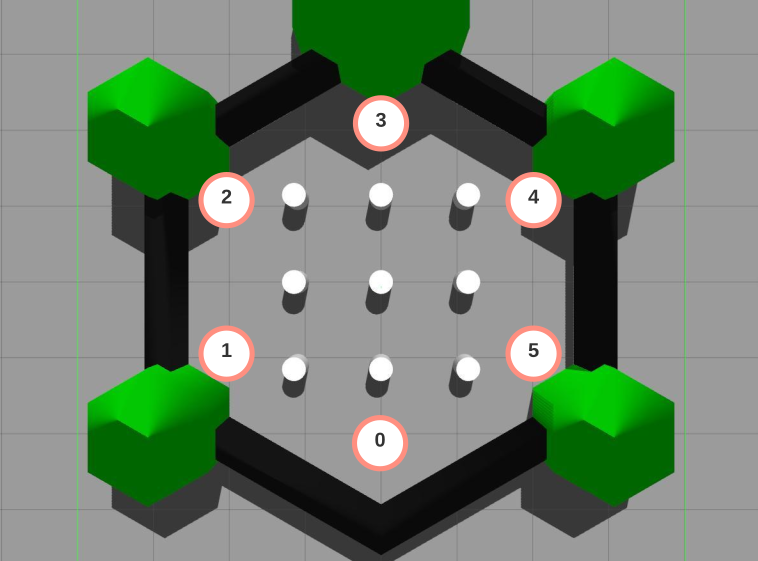

# Obstacle-Avoidance-System
## Overview
We develop a ROS package to move TurtleBot3 in a Gazebo world. It is capable of avoiding obstacles while navigating to the goal location. We can run the node with a location argument passed to the command line. Based on the argument passed, we move the robot from its current location to the goal
location. For instance, the commands below should move the robot in this order: 0 → 1 and then 1 → 5 .
  ```
  rosrun rwa2_savnani my_bot_controller 1
  ```
  ```
  rosrun rwa2_savnani my_bot_controller 5
  ```



---

## Dependencies
- Ubuntu 18.04 (Operating System)
- Python 3.6.9
- CMake (Build System)
- ROS Melodic
- Gazebo
- RVIZ

---
## ROS Dependencies
- Rospy
- Tf
- sensor_msgs
- nav_msgs
- geometry_msgs


---
## Build Instructions
Follow the build instructions to build on your local system. 

- Make and initialize the catkin workspace.
  ```
  mkdir -p ~/catkin_ws/src
  catkin config --init
  ```

- Clone this repo and copy the rwa2_savnani folder to the src directory in catkin_ws. 
  ```
  git clone https://github.com/savnani5/Obstacle-Avoidance-System.git
  cd ~/catkin_ws/src
  cp -R ~/Obstacle-Avoidance-System/rwa2_savnani ~/catkin_ws/src
  ```

- Build the workspace
  ```
  catkin build
  ```

---
## Run Instructions
- The *my_bot_controller.launch* file has all the launch parameters. Run the following command to spawn the robot at (-2,0) position.
  ```
  roslaunch rwa2_savnani my_bot_controller.launch
  ```
- Run the folllowing command to mkae the robot navigate to position "**x**" in the map.
  ```
  rosrun rwa2_savnani my_bot_controller x
  ```

---
 ## Output Video

An sample output video for the config file : [final_ariac_2021.yaml](./rwa5_group_1/config/final_ariac_2021.yaml) is shown below.

 [](https://www.youtube.com/watch?v=VHgZroqvAyw&ab_channel=RodrigoPerez)

An sample output video for the config file : [rwa5-sample.yaml](./rwa5_group_1/config/rwa5-sample.yaml) is shown below.

 [](https://www.youtube.com/watch?v=ij6FFzRd-K4&ab_channel=RodrigoPerez)


